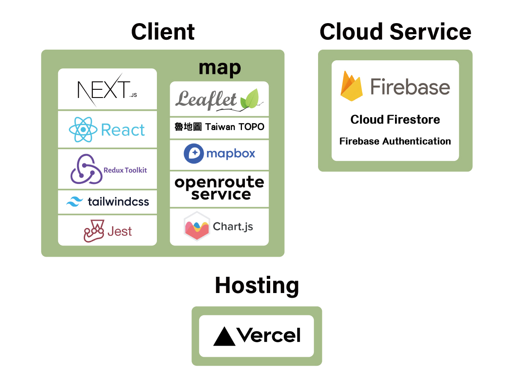

## HikePlanner

為台灣登山愛好者設計的免費路線規劃平台，規劃專屬的登山行程，並取得路線資訊，爬升下降高度和行走時間，海拔剖面圖地點可即時渲染到地圖上觀看，完成後可儲存與分享行程，並匯出照片和GPX。

## Technologies
- React
  - React Hooks
  - Reack Context
- Redux Toolkit
- Firebase
  - Firestore Database
  - Authentication
  - Storage
- Tailwind CSS  
- Next.js
- Vercel

## Architecture
整合leaflet地圖、openrouteservice最短路徑和chart.js圖表，來開發主要功能

地圖與路線規劃圖層互動內容

## Demo

### 景點搜尋標記
點擊地圖任一點，或使用搜尋功能，查詢景點名稱並標記

### 最短路徑計算
新增景點後可規劃行程，並計算最短路徑，景點可新增刪除

### 路線分析
提供路線資訊，爬升下降高度、里程、行走時間，海拔剖面圖可直接對應地圖景點

### 儲存與匯出GPX和照片
可儲存或匯出GPX和照片，也可公開分享

### 一鍵複製行程，重新規劃專屬路徑
可複製他人規劃好的路線，並重新規劃

## Contact
Name : 鄭竹晴  
Email : luluching1128@gmail.com

